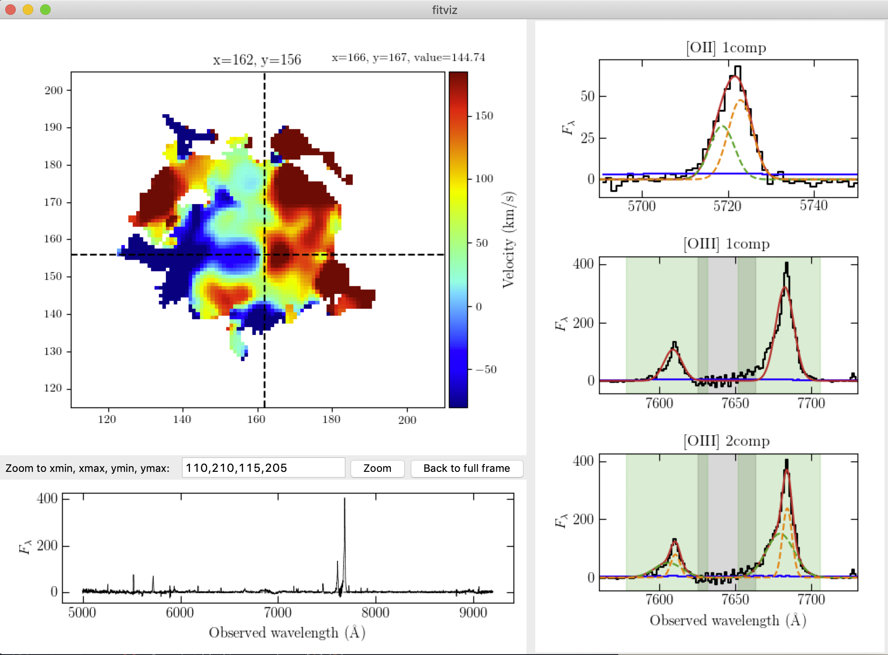

# fitviz

## Description

`fitviz` is a python package for interactive visualization of spectral model fitting results for 3D IFU datacubes. 

### Motivation

Extracting information from wide-field, integral-field-unit data (IFU) (such as data taken by [VLT/MUSE](https://www.eso.org/sci/facilities/develop/instruments/muse.html
), [Keck/KCWI](https://www2.keck.hawaii.edu/inst/kcwi/), etc.) often involves conducting model fitting to the spectral line profiles.  Inspecting the fitting results, and more importantly comparing the goodness-of-fit among several different models across many spaxels within the field of view, require displaying the IFU data (with access to both the spatial and spectral dimension) and different models at the same time.  Here I wrote this small package `fitviz` to execute this task in an interactive way. 

I implemented the code with `Tkinter`, simply because `Tkinter` came with python by default and it was included in the first book I used to learn python.  All figure panels are rendered through embedding `matplotlib` in `Tk`, and can get a bit slow as you add more panels.  I might re-implement it in `PyQt` to make the rendering more smooth.  But it's functional for now and I'm unlikely to put in the effort unless there is a need from people other than myself (so do let me know if you end up using it and can't stand the time lag between clicking and display updates :-) ).  

### Main features:

- Load the 3D datacube while displaying a 2D image of your choice (velocity map, intensity map, chi-square map, BIC difference map, etc.)

- Easy visualization of different model fitting results by displaying them at the same time.  You can customize how many panels you want to display, what range of data to show and what model to show for each panel.  

- Easy visualization of the data range used in the chi-square/BIC calculation.  You can highlight the chi-square window and noise regions green and gray shaded area, respectively, in individual panels.  Comes in handy when assessing how robustly you can select one model against another based on BIC, or any goodness-of-fit merit. 

- Easy zoom in/out through the "zoom" button.

## How to install

### Dependencies:

- Numpy
- Scipy
- Astropy
- Tkinter
- Matplotlib

To use the code, simply clone the directory:
`git clone git@github.com:mandychen-astro/fitviz.git`

Then use `python /path_to_fitviz_dir/main.py data_config.dat model_config.py`.  See example below and files in `example/` for how to write the config files.

## Example

Here is an example, using the VLT/MUSE data for the QSO field PKS0454-22.  You'll see how to write up the `data_config.dat` and `model_config.py` files here.  Datacube is publically available on the [VLT data archive](http://archive.eso.org/wdb/wdb/adp/phase3_spectral/form) with PID: 0100.A-0753. The example datacube here is further processed by me to have the QSO light subtracted, and is not included in this repo due to its large size (~5Gb).  But it should be easy for you to replace the paths in the `data_config.dat` to use your own datacube and image. Finally, to start, simply type `python main.py data_config.dat model_config.py`.  You should see a window like this:

